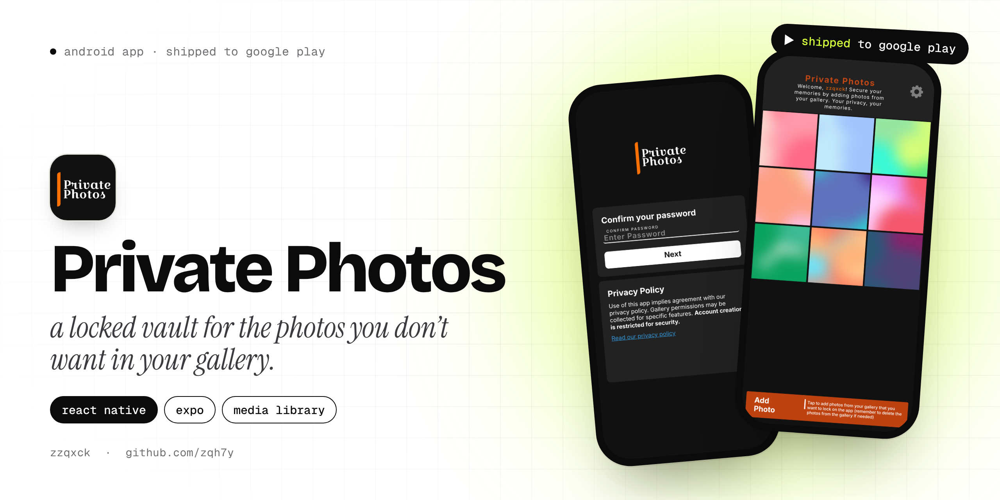
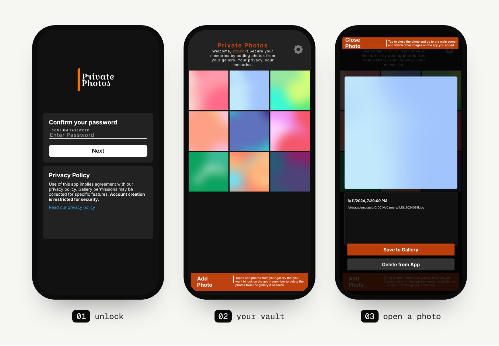

<p align="center">
  
</p>

<p align="center">
  
  
  
  
</p>

# Private Photos

Private Photos is a locked place on your phone for the pictures you don't want sitting in your main gallery. You set a password the first time you open it, then pull photos in from your gallery. After that, every time the app opens it asks for the password before it shows anything.

It went up on Google Play as **Private Photos: Secure Photos** in 2024. No account, no cloud, no ads in the code. Your photos stay on your phone.

> **Where's the code?** The `master` branch only has the starter Expo files. The real app is on the **[`main`](https://github.com/zqh7y/PrivatePhotos/tree/main)** branch.

## Screens

<p align="center">
  
</p>

<sub>The photos in the grid are placeholder images.</sub>

## Features

- **Password lock.** You create a password in two steps (type it, then confirm it), and the app asks for it every time it opens.
- **Import from your gallery.** Pick several photos at once and they land in a 3-column grid.
- **Open any photo** full size, with the date you added it.
- **Save back to the gallery** when you want a photo out again, or **delete it from the app**.
- **Select and delete** several photos at once with an edit mode.
- **Privacy policy screen** built into the app.

## How it's built

| Part | Tech |
|---|---|
| Framework | React Native 0.73, Expo SDK 50 |
| Navigation | React Navigation (stack) |
| Photos | `expo-image-picker` (multi-select), `expo-media-library` (save back) |
| Storage | `@react-native-async-storage/async-storage`, `expo-sqlite` |
| State | React Context for the theme |
| Release | EAS Build, published on Google Play |

The screens are `Welcome` (create a password), `Lock` (enter it), `Main` (the vault) and `Privacy`. On launch the app checks whether a password exists and sends you to the right one, so a fresh install always starts with password creation and every launch after that starts locked.

One thing to be clear about: this is a privacy app, not encryption. The password keeps people out of the app, which is what it's for, but the photos themselves aren't encrypted on the device.

## Run it yourself

```bash
git clone -b main https://github.com/zqh7y/PrivatePhotos.git
cd PrivatePhotos
npm install
npx expo start
```

Scan the QR code with Expo Go, or press `a` for an Android emulator.

---

<p align="center">
  Made by <b>zzqxck</b> · <a href="https://zqh7y.github.io/Portfolio/">portfolio</a> · <a href="https://github.com/zqh7y">more projects</a>
</p>
